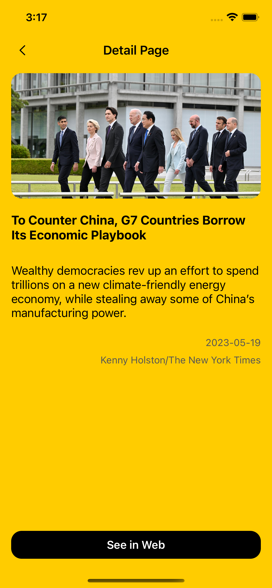
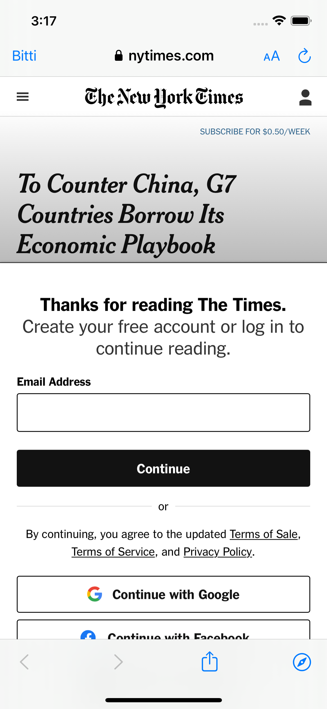

# ahmetmertoz_hw2
## Popular Global News

<b>Popular Global News UIKit kullanılarak oluşturulmuş, New York Times'ın API'sinde sunulan popüler haberleri çekerek kullanıcıya gösteren bir mobil uygulamadır.</b>

## Uygulamanın Amacı
◉ Bu uygulamanın amacı belirlenen <b>dictionaryapi.dev</b> ve <b>datamuse</b> Api'lerini çekip, Api'de araması yapılan kelimenin var eş anlamlılarını ve aranan kelimenin, "noun", "verb" gibi özelliklerinin görüntülenmesini sağlayıp, varsa o anlamla ilgili bir örnek listelemektir.

◉ Ana sayfada bulunan liste, yapılmış son 5 aramayı göstermektedir.

◉ Kullanıcı bir kelimeyi aradığı zaman ya da geçmiş aradığı kelimeye bastığı zaman o kelimenin detay ekranına gidecektir.. Detay ekranında kelimenin bilgileriyle beraber belirli bilgileriyle oluşturulmuş olan örnekler gösterilmektedir.

◉ Eğer api'de aranan kelimenin okunuşu varsa detay ekranının sağ üst köşesindeli hoparlör butonuna basılarak okunuşu dinlenebilmektedir.

◉ Detay ekranında kelimenin özellikleri kategori olarak listelenmektedir. Kullanıcı istediği kategoriyi ya da kategorileri seçerek o kelimeye yönelik filtreleme işlemini gerçekleştirebilir.

◉ Modülerliği sağlamak adına Generic olarak oluşturduğum Web Paketi olan <b>AhmertNetworkManager</b> projede kullanılarak <b>SPM</b> ile projeye dahil edilmiştir.

## AhmertNetworkManager 
Projede servis istekleri için URLSession ile oluşturmuş olduğum <b>AhmertNetworkManager</b> paketine <a href="https://github.com/ahmetmert1/AhmertNetworkManager">BURADAN</a> ulaşabilirsiniz

## Teknik Detaylar

<ul>
<li> Storyboard kullanılmıştır. </li>
<li> MVVM mimarisi ile geliştirilmiştir. </li>
<li> URLSession ile oluşturduğum AhmertNetworkManager Package'i kullanılmıştır. </li>
<li> Tüm UI'lar cihaz rotationuna göre güncellenmektedir. </li>
<li> AVFoundation ile ses oynatımı yapılmıştır. </li>
<li> CoreData ile kullanıcının aramaları kaydedilmektedir. </li>
<li> Proje iOS 13 ve üzerinde çalışmaktadır. </li>

</ul>

  

## Nasıl Kurulur?
Projeyi Xcode ile clone ettikten sonra .xcodeproj dosyası ile projeyi açabilirsiniz.
 
# 💻 Teknolojiler 
- Swift
- AhmertNetworkManager
- SD_WebImage
- MVVM Architecture
- SafariServices

[Linkedin](https://www.linkedin.com/in/ahmet-mert-öz)

[E-posta](ahmetmertoz11@gmail.com)
